# AutoChain eSupplyPro

A full-stack B2B supply chain operations platform for window, door, and glass distributors. Three role-based portals (customer, vendor, admin) with an integrated AI assistant, real-time order tracking, invoice management, and workflow automation.

Built as a TypeScript monorepo with Next.js, Fastify, SQLite, and Drizzle ORM.

---

## Product Tour

The platform is split across three role-based portals. The assistant is persistent in every view, so the desktop captures work better as linked thumbnails than full-width inline images.

Click any thumbnail to open the full-size screenshot.

### Customer Portal

Customers manage orders, track deliveries, review invoices, and work alongside an AI assistant that surfaces supply chain insights.

Core areas: dashboard, delivery tracking, visual insights, orders, invoices, products, documents, workflows, AI insights, and EDI monitoring.

<details>
<summary><strong>Open customer screenshots</strong></summary>

<table>
  <tr>
    <td width="50%" valign="top">
      <a href="docs/screenshots/01-login.png">
        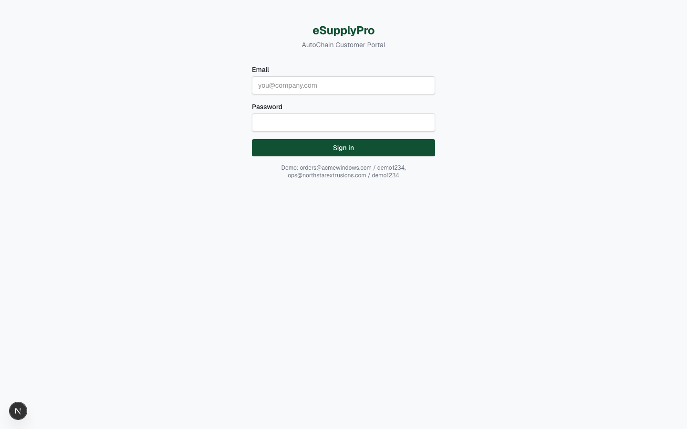
      </a><br />
      <strong>Login</strong><br />
      Demo sign-in entry point for all three roles.
    </td>
    <td width="50%" valign="top">
      <a href="docs/screenshots/02-customer-dashboard.png">
        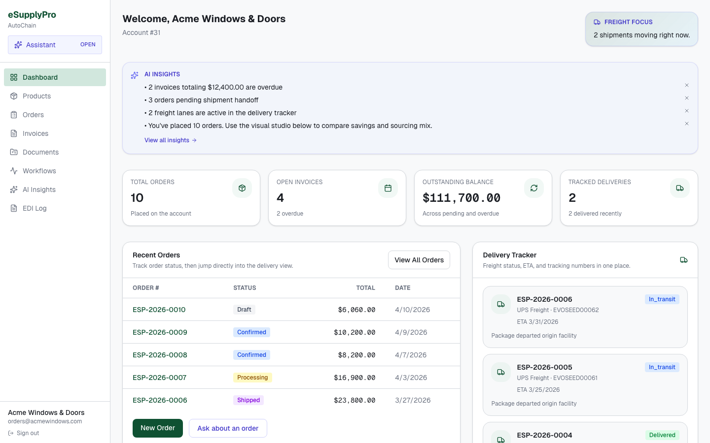
      </a><br />
      <strong>Dashboard</strong><br />
      Orders, balances, delivery tracking, and analytics studio.
    </td>
  </tr>
  <tr>
    <td width="50%" valign="top">
      <a href="docs/screenshots/03-delivery-insights.png">
        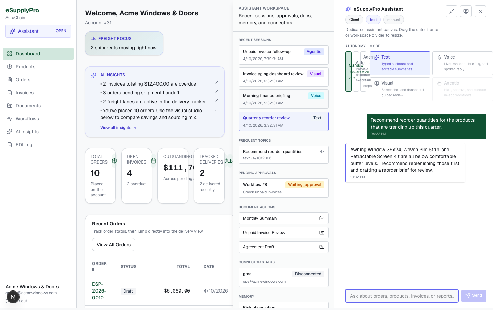
      </a><br />
      <strong>Delivery Tracker &amp; Visual Insights</strong><br />
      ETA tracking and prompt-driven chart generation.
    </td>
    <td width="50%" valign="top">
      <a href="docs/screenshots/04-orders.png">
        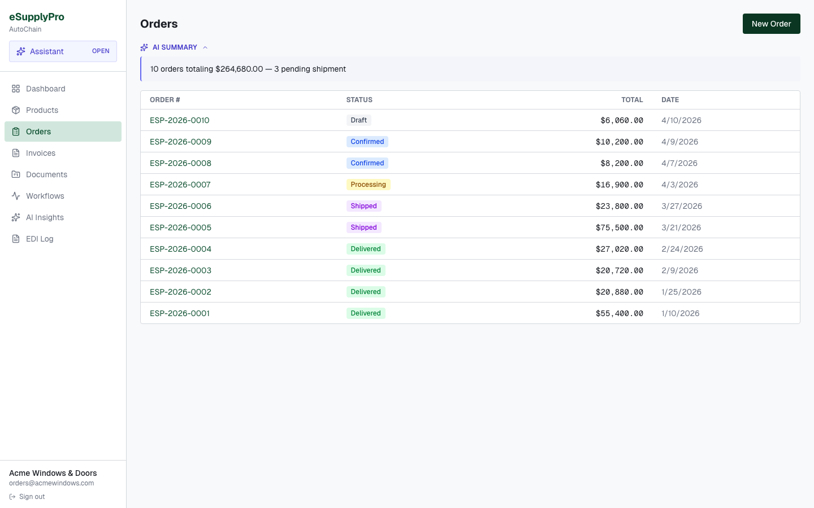
      </a><br />
      <strong>Orders</strong><br />
      Draft-to-delivery order management with AI summaries.
    </td>
  </tr>
  <tr>
    <td width="50%" valign="top">
      <a href="docs/screenshots/05-invoices.png">
        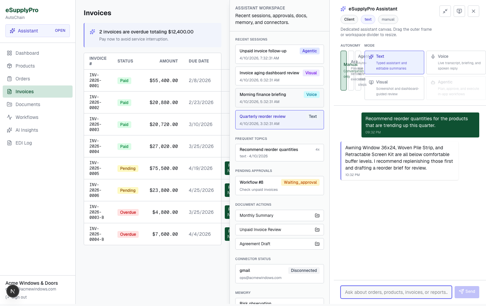
      </a><br />
      <strong>Invoices</strong><br />
      Payment status, overdue alerts, and quick actions.
    </td>
    <td width="50%" valign="top">
      <a href="docs/screenshots/06-products.png">
        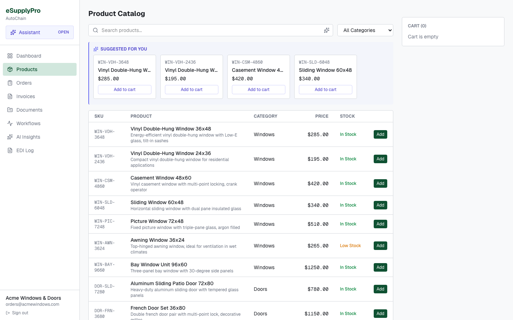
      </a><br />
      <strong>Products</strong><br />
      Catalog browsing with stock levels and pricing.
    </td>
  </tr>
  <tr>
    <td width="50%" valign="top">
      <a href="docs/screenshots/07-documents.png">
        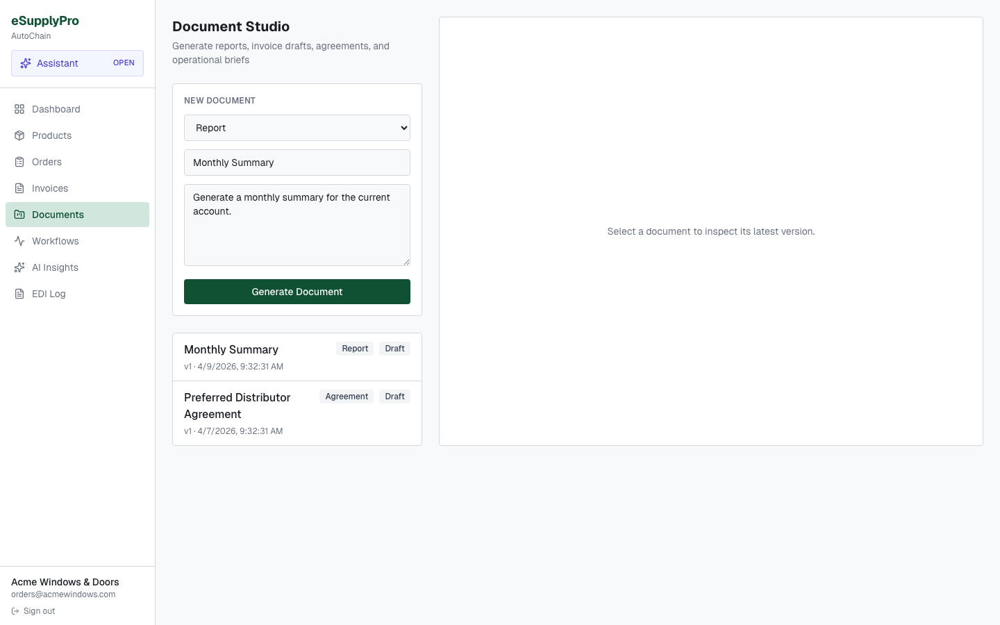
      </a><br />
      <strong>Documents</strong><br />
      Versioned AI-generated reports, agreements, and briefs.
    </td>
    <td width="50%" valign="top">
      <a href="docs/screenshots/08-workflows.png">
        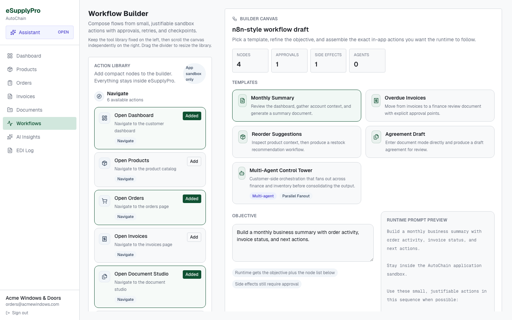
      </a><br />
      <strong>Workflows</strong><br />
      Approval-based automation with autonomous execution options.
    </td>
  </tr>
  <tr>
    <td width="50%" valign="top">
      <a href="docs/screenshots/09-insights.png">
        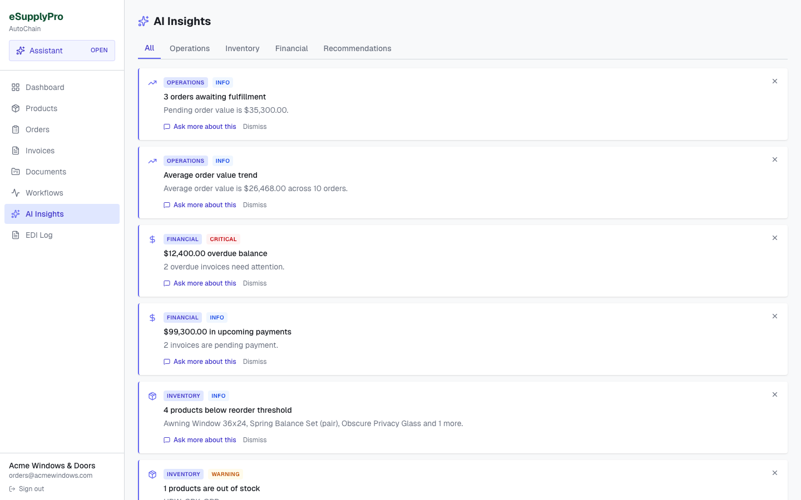
      </a><br />
      <strong>AI Insights</strong><br />
      Signals from order patterns, freight, aging, and inventory.
    </td>
    <td width="50%" valign="top">
      <a href="docs/screenshots/10-edi.png">
        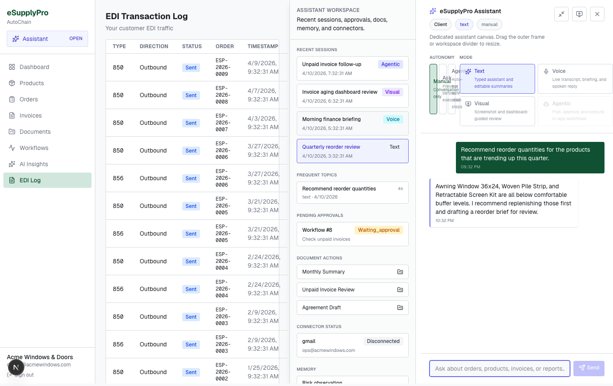
      </a><br />
      <strong>EDI Log</strong><br />
      Purchase order, invoice, and shipping transaction history.
    </td>
  </tr>
</table>

</details>

### Vendor Portal

Vendors handle inbound purchase orders, catalog availability, outbound freight, and invoice submission.

Core areas: vendor dashboard, purchase orders and freight, catalog management, and invoice processing.

<details>
<summary><strong>Open vendor screenshots</strong></summary>

<table>
  <tr>
    <td width="50%" valign="top">
      <a href="docs/screenshots/11-vendor-dashboard.png">
        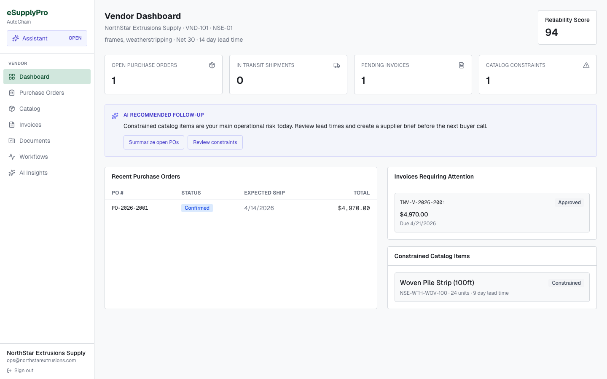
      </a><br />
      <strong>Vendor Dashboard</strong><br />
      Reliability score, PO summary, and follow-up actions.
    </td>
    <td width="50%" valign="top">
      <a href="docs/screenshots/12-vendor-purchase-orders.png">
        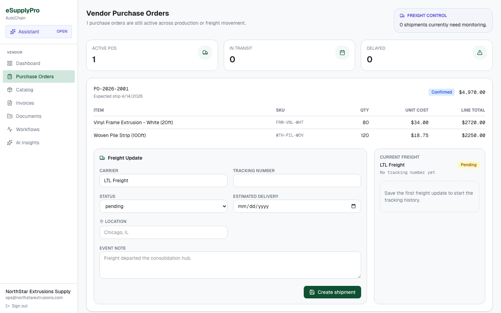
      </a><br />
      <strong>Purchase Orders &amp; Freight</strong><br />
      Line items, carrier updates, and delivery tracking.
    </td>
  </tr>
  <tr>
    <td width="50%" valign="top">
      <a href="docs/screenshots/13-vendor-catalog.png">
        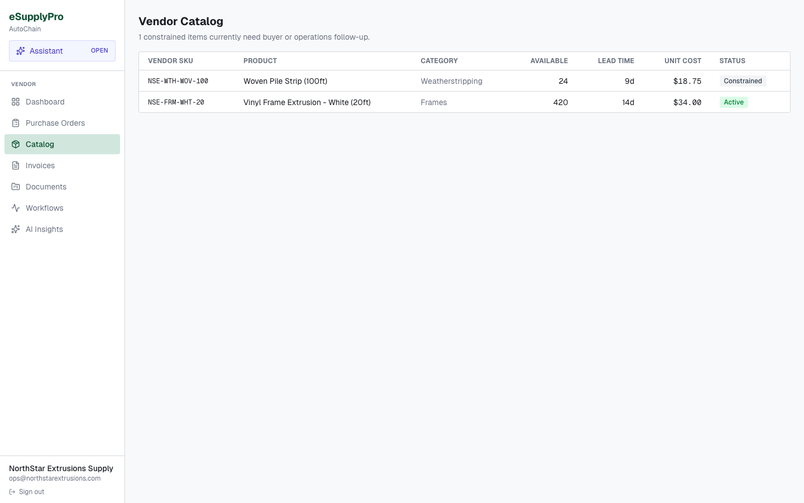
      </a><br />
      <strong>Vendor Catalog</strong><br />
      Lead times, MOQs, stock constraints, and availability controls.
    </td>
    <td width="50%" valign="top">
      <a href="docs/screenshots/14-vendor-invoices.png">
        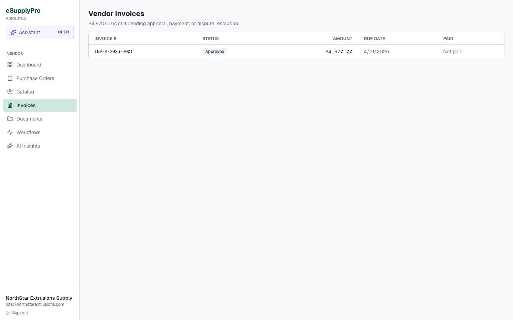
      </a><br />
      <strong>Vendor Invoices</strong><br />
      PO-linked invoice workflow from pending to paid.
    </td>
  </tr>
</table>

</details>

### Admin Portal

Platform administrators manage users, sessions, and cross-account visibility across the full system.

Core areas: global dashboard, user management, and session monitoring.

<details>
<summary><strong>Open admin screenshots</strong></summary>

<table>
  <tr>
    <td width="50%" valign="top">
      <a href="docs/screenshots/15-admin-dashboard.png">
        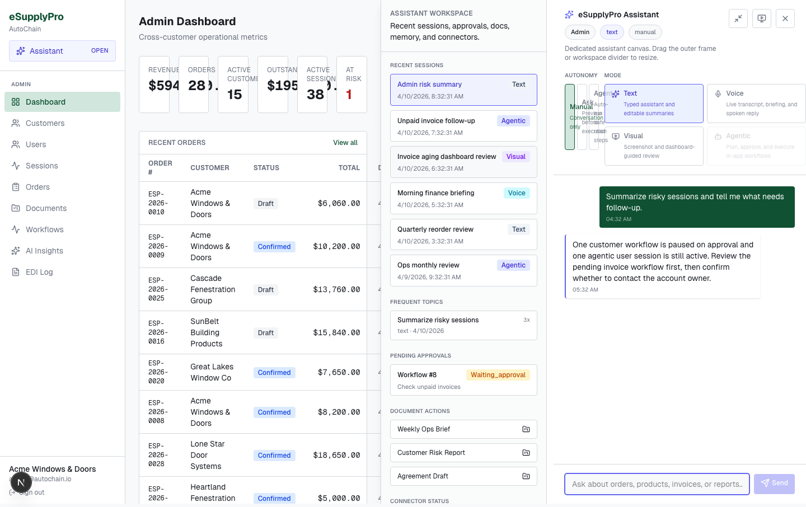
      </a><br />
      <strong>Admin Dashboard</strong><br />
      Revenue, order volume, active users, and cross-customer activity.
    </td>
    <td width="50%" valign="top">
      <a href="docs/screenshots/16-admin-users.png">
        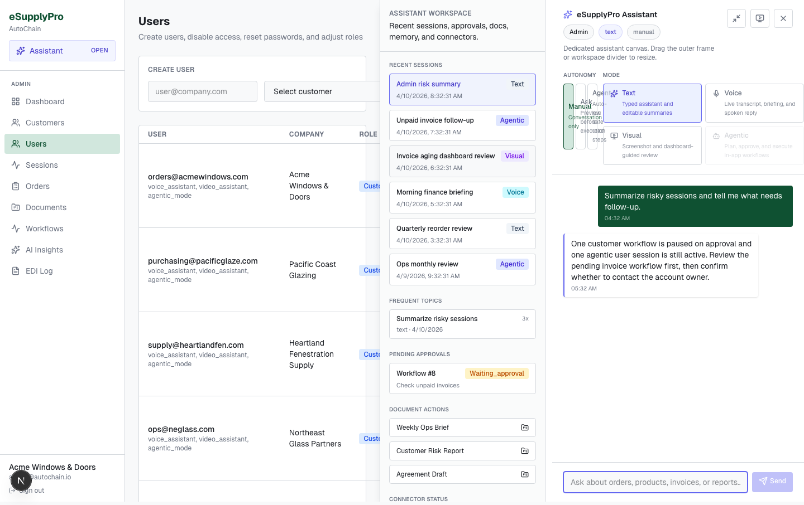
      </a><br />
      <strong>User Management</strong><br />
      Role assignment, status control, and feature flags.
    </td>
  </tr>
  <tr>
    <td width="50%" valign="top">
      <a href="docs/screenshots/17-admin-sessions.png">
        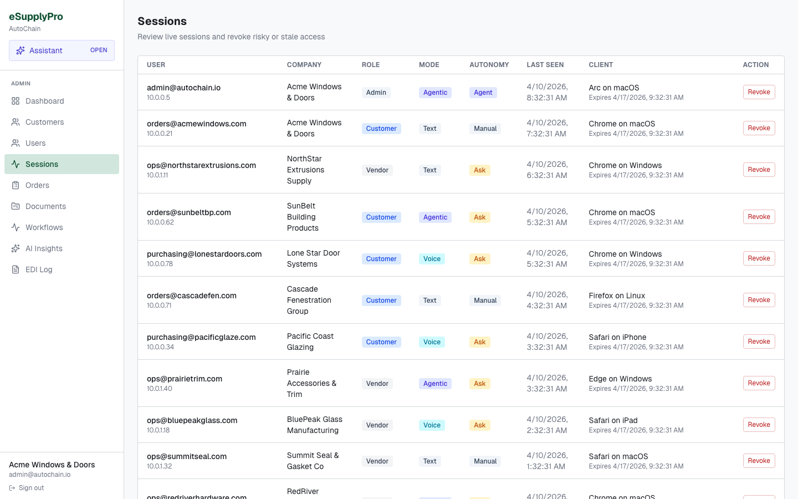
      </a><br />
      <strong>Session Management</strong><br />
      Active sessions, IP addresses, user agents, and revocation.
    </td>
    <td width="50%"></td>
  </tr>
</table>

</details>

---

## AI Assistant

Every portal includes a persistent AI assistant workspace with four interaction modes:

| Mode | Description |
|------|-------------|
| **Text** | Typed conversation with editable summaries |
| **Voice** | Live transcript with spoken replies (browser SpeechRecognition + speechSynthesis) |
| **Visual** | Screenshot and dashboard-guided review |
| **Agentic** | Plan, approve, and execute in-app workflows autonomously |

The assistant has memory, connector integrations (Gmail), document generation, and context-aware caching.

---

## Tech Stack

| Layer | Technology |
|-------|-----------|
| Frontend | Next.js 15 (App Router), TypeScript, Tailwind CSS |
| Backend | Fastify, TypeScript |
| Database | SQLite via Drizzle ORM |
| AI | Ollama (local LLM), workflow runtime |
| Validation | Zod (shared schemas) |
| Monorepo | pnpm workspaces, Turborepo |
| Testing | Vitest (39 tests across 9 files) |

## Architecture

```
autochain/
  apps/
    web/          Next.js frontend (App Router)
    api/          Fastify REST API
  packages/
    db/           Drizzle schema, SQLite client, seed data
    shared/       Zod schemas, TypeScript contracts
  data/           SQLite database (gitignored)
```

## Quick Start

```bash
# Install dependencies
pnpm install

# Seed the database (16 users, 10 clients, 5 vendors, 28 orders, full supply chain data)
pnpm --filter @autochain/db seed

# Start the API (port 3001)
pnpm --filter @autochain/api dev

# Start the frontend (port 3000)
pnpm --filter @autochain/web dev
```

## Demo Accounts

All accounts use password `demo1234`.

### Customers (10)

| Email | Company |
|-------|---------|
| orders@acmewindows.com | Acme Windows & Doors |
| purchasing@pacificglaze.com | Pacific Coast Glazing |
| supply@heartlandfen.com | Heartland Fenestration |
| ops@neglass.com | Northeast Glass Partners |
| orders@sunbeltbp.com | SunBelt Building Products |
| buy@mtnviewcs.com | Mountain View Contractors |
| procurement@greatlakeswin.com | Great Lakes Window Co |
| sales@seaglass.com | Southeastern Architectural |
| orders@cascadefen.com | Cascade Fenestration Group |
| purchasing@lonestardoors.com | Lone Star Door Systems |

### Vendors (5)

| Email | Company |
|-------|---------|
| ops@northstarextrusions.com | NorthStar Extrusions Supply |
| ops@bluepeakglass.com | BluePeak Glass Manufacturing |
| ops@redriverhardware.com | RedRiver Hardware Components |
| ops@summitseal.com | Summit Seal & Gasket Co |
| ops@prairietrim.com | Prairie Accessories & Trim |

### Admin

| Email | Role |
|-------|------|
| admin@autochain.io | Platform administrator |

## Seed Data

The seed script is idempotent — it skips if users already exist to preserve sessions and documents. Use `--force` to wipe and re-seed:

```bash
# First run or incremental (safe)
pnpm --filter @autochain/db seed

# Full reset
pnpm --filter @autochain/db seed -- --force
```

Seeded data includes: 22 products, 28 orders, 19 invoices, 17 shipments, 5 purchase orders, 5 vendor profiles, 10 documents, 12 assistant sessions, and 3 automated workflow runs.

## Testing

```bash
# Run all tests
pnpm test

# Run API tests only
pnpm --filter @autochain/api test

# Typecheck all packages
pnpm typecheck
```

## License

MIT
